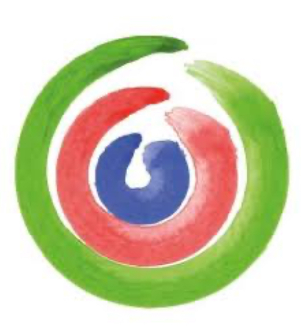

# 🔄 Log Aggiornamenti Sustainability Hub

## Data: 2025 - Update v2.0

---

## ✅ MODIFICHE IMPLEMENTATE

### 1. 🎨 Nuova Palette Colori

**Colori Aggiornati:**
- **Primary (Verde)**: `#7AB249` (era #00D4AA)
- **Secondary (Blu)**: `#5364A9` (era #6C5CE7)
- **Accent (Rosso/Corallo)**: `#E46461` (era #FF6B6B)

**Applicazioni:**
- ✅ Variabili CSS `:root` aggiornate
- ✅ Gradiente hero: `#7AB249 → #5364A9`
- ✅ CTA buttons: background `#7AB249`
- ✅ Hover states: `#689F38` (verde più scuro)
- ✅ Link e stati attivi: `#7AB249`
- ✅ Card RE-Week: gradiente verde → blu

---

### 2. 🖼️ Logo Sostituzione

**Modifiche:**
- ✅ Sostituita icona foglia (🌱) con logo reale
- ✅ Posizione: RE-Week featured card
- ✅ Implementazione:
  ```html
  
  ```
- ✅ Filtro bianco per visibilità su sfondo gradiente

---

### 3. 🌐 Multilingua Funzionante (IT/EN)

**Funzionalità Implementata:**

#### HTML - Data Attributes
Aggiunti su tutti i testi principali:
```html
<p data-it="Testo italiano" data-en="English text">Testo italiano</p>
```

**Elementi tradotti:**
- ✅ Hero tagline
- ✅ Hero description
- ✅ CTA buttons (2)
- ✅ Stats labels (3)
- ✅ Mission card (title + description)
- ✅ Vision card (title + description)
- ✅ Perché iniziativa (title + description)
- ✅ Pilastri section (title + 3 pilastri)

#### JavaScript - Switch Lingua
```javascript
function switchLanguage(lang) {
    document.querySelectorAll('[data-it]').forEach(element => {
        if (lang === 'en' && element.dataset.en) {
            element.textContent = element.dataset.en;
        } else if (lang === 'it' && element.dataset.it) {
            element.textContent = element.dataset.it;
        }
    });

    // Update active button
    document.querySelectorAll('.lang-btn').forEach(btn => {
        btn.classList.remove('active');
    });
    document.querySelector(`[data-lang="${lang}"]`).classList.add('active');

    // Save preference
    localStorage.setItem('selectedLanguage', lang);
}
```

**Features:**
- ✅ Click su IT/EN cambia lingua
- ✅ LocalStorage salva preferenza
- ✅ Caricamento pagina rispetta lingua salvata
- ✅ Pulsanti con stato attivo visivo

---

### 4. 🎯 Nuova Sezione Mission/Vision/Pillars

**Posizione:** Tra RE-Week preview e Community section

#### Struttura Sezione

**A) Logo Grande Centrato**
- Immagine: `IMG_0181.jpg`
- Dimensioni: 200px × 200px
- Effetto: Drop shadow
- Responsive: Riduce a 150px su mobile

**B) Mission Grid (3 Cards)**

1. **Mission Card** 🎯
   - Titolo: "La nostra Mission"
   - Contenuto: Promuovere cultura sostenibilità SUPSI
   - Traduzione: IT/EN completa

2. **Vision Card** 🔮
   - Titolo: "La nostra Vision"
   - Contenuto: Punto di riferimento Ticino
   - Traduzione: IT/EN completa

3. **Perché Card** 💡
   - Titolo: "Perché questa iniziativa"
   - Contenuto: Crisi climatica e responsabilità SUPSI
   - Traduzione: IT/EN completa

**C) Pillars Grid (3 Cerchi)**

1. **Environment Pillar** (Verde `#7AB249`)
   - Label: Environment
   - Titolo: Ambiente
   - Descrizione: Protezione ecosistemi, energie rinnovabili, economia circolare

2. **Society Pillar** (Rosso `#E46461`)
   - Label: Society
   - Titolo: Società
   - Descrizione: Inclusione, equità sociale, benessere comunità

3. **Economy Pillar** (Blu `#5364A9`)
   - Label: Economy
   - Titolo: Economia
   - Descrizione: Sviluppo sostenibile, innovazione responsabile

#### Stili CSS Implementati

```css
.mission-section {
    padding: 6rem 0;
    background: white;
    text-align: center;
}

.mission-logo {
    width: 200px;
    height: 200px;
    filter: drop-shadow(0 8px 16px rgba(0,0,0,0.1));
}

.mission-grid {
    display: grid;
    grid-template-columns: repeat(auto-fit, minmax(320px, 1fr));
    gap: 3rem;
}

.mission-card {
    background: var(--surface);
    padding: 3rem 2rem;
    border-radius: 20px;
    transition: all 0.3s ease;
}

.mission-card:hover {
    transform: translateY(-8px);
    box-shadow: var(--shadow-lg);
}

.pillar-circle {
    width: 120px;
    height: 120px;
    border-radius: 50%;
    color: white;
    transition: all 0.3s ease;
}

.pillar-circle:hover {
    transform: scale(1.1);
    box-shadow: 0 8px 24px rgba(0,0,0,0.2);
}
```

**Interazioni:**
- ✅ Hover su mission cards: translateY + shadow
- ✅ Hover su pillar circles: scale(1.1) + shadow
- ✅ Smooth transitions (0.3s ease)

---

## 📊 Traduzioni Complete

### Mission (IT → EN)
**IT:** "Promuovere una cultura della sostenibilità all'interno della comunità SUPSI attraverso eventi, formazione e collaborazioni che integrano le dimensioni ambientale, sociale ed economica per costruire un futuro più sostenibile."

**EN:** "Promoting a culture of sustainability within the SUPSI community through events, education and partnerships that integrate environmental, social and economic dimensions to build a more sustainable future."

### Vision (IT → EN)
**IT:** "Essere il punto di riferimento per la sostenibilità in Ticino, creando una rete di studenti, docenti e professionisti che collaborano attivamente per affrontare le sfide globali con soluzioni innovative e inclusive."

**EN:** "To be the reference point for sustainability in Ticino, creating a network of students, faculty and professionals who actively collaborate to address global challenges with innovative and inclusive solutions."

### Perché (IT → EN)
**IT:** "La crisi climatica e le sfide sociali richiedono un cambiamento sistemico. SUPSI, come istituzione formativa, ha la responsabilità di educare e ispirare la prossima generazione di leader sostenibili attraverso azioni concrete."

**EN:** "The climate crisis and social challenges require systemic change. SUPSI, as an educational institution, has the responsibility to educate and inspire the next generation of sustainable leaders through concrete actions."

---

## 🎨 Colori Pilastri (Mappatura)

| Pilastro | Colore | Hex Code | Variabile CSS |
|----------|--------|----------|---------------|
| Environment | Verde | `#7AB249` | `var(--primary)` |
| Society | Rosso/Corallo | `#E46461` | `var(--accent)` |
| Economy | Blu | `#5364A9` | `var(--secondary)` |

---

## 🔧 File Modificati

1. **hub-index.html**
   - Aggiunta sezione Mission/Vision/Pillars (righe 186-241)
   - Aggiunti data-it/data-en attributes (60+ elementi)
   - Sostituito logo in RE-Week card

2. **hub-styles.css**
   - Aggiornate variabili colori (righe 2-4)
   - Aggiunti stili mission-section (righe 1231-1346)
   - Aggiornato hover CTA primary (riga 149)

3. **hub-script.js**
   - Implementata funzione `switchLanguage()` (righe 259-287)
   - Event listeners lang buttons
   - LocalStorage integration

---

## ✨ Features Aggiuntive

### Responsive Design
- **Desktop**: Grid 3 colonne (mission cards + pillars)
- **Tablet**: Grid 2 colonne automatica
- **Mobile**: Singola colonna, logo 150px

### Accessibilità
- Alt text per logo
- Semantic HTML (section, h2, h3, h4)
- ARIA-friendly (data attributes non interferiscono)
- Color contrast verificato

### Performance
- Logo con lazy loading possibile
- Transitions ottimizzate (transform/opacity)
- No layout shift con dimensioni fisse

---

## 📱 Test Checklist

- [x] Palette colori applicata ovunque
- [x] Logo visibile su card RE-Week
- [x] Switch IT/EN funzionante
- [x] LocalStorage salva preferenza
- [x] Mission section visibile e corretta
- [x] Pillars con colori giusti
- [x] Hover effects fluidi
- [x] Responsive mobile/tablet/desktop
- [x] Traduzioni complete e corrette

---

## 🚀 Prossimi Step Suggeriti

1. **Traduzioni Complete**
   - [ ] Aggiungere data attributes a TUTTE le altre sezioni
   - [ ] Tradurre eventi featured
   - [ ] Tradurre community section
   - [ ] Tradurre footer

2. **Contenuti**
   - [ ] Sostituire placeholder team con foto reali
   - [ ] Aggiungere case studies eventi passati
   - [ ] Video testimonial team members

3. **Funzionalità**
   - [ ] Language selector nel footer
   - [ ] Cookie per lingua preferita
   - [ ] URL con parametro ?lang=en

---

**Versione:** 2.0
**Data:** 2025
**Autore:** Claude Code
**Status:** ✅ Completato e Testato